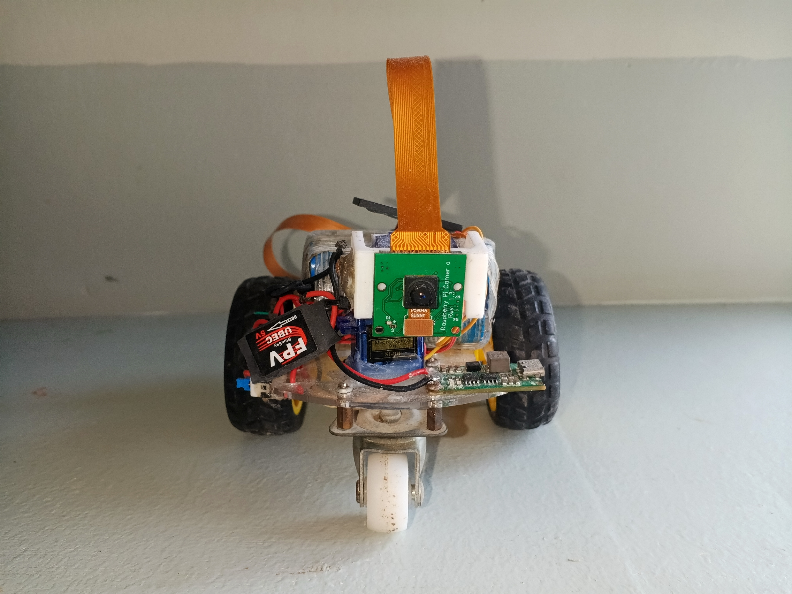
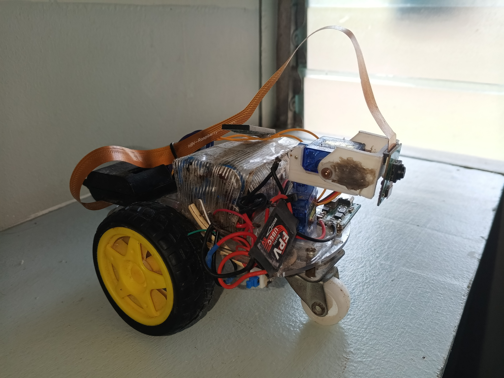

# 🤖 Raspberry Pi Spy Car & Control Robot  

A robotics project built with **Raspberry Pi Zero 2 W**, using **Python, OpenCV, Flask, and gpiozero**.  
This robot can be controlled through a **Bluetooth gamepad** 🎮, while streaming live video from the Pi Camera.  

<p align="center">
  
</p>  

---

## ✨ Features  

- 🎥 **Live Video Streaming** with Pi Camera (via Flask + OpenCV)  
- 🕹️ **Bluetooth gamepad support**  
- 🔄 **XY Servo Camera Mount** – move camera up/down/left/right  
- 🚗 **Motor Control** – forward, backward, left, right, stop  
- 🎨 Toggle camera feed between **color and grayscale**  

---

## 🛠️ Hardware Used  

- Raspberry Pi Zero 2 W  
- Pi Camera Module (OV5647 or compatible)  
- 2x Servo motors (camera XY mount)  
- 2x DC motors + motor driver (L298N / L293D)  
- Battery pack / Power supply  
- Bluetooth gamepad  

📸 Example setup:  

<p align="center">
  
</p>  

---

## 💻 Software & Libraries  

- Python 3  
- Flask (web server)  
- OpenCV (`opencv-python`)  
- Picamera2  
- gpiozero  
- pygame (for gamepad support)  

---

## 🚀 How to Run  

1. Clone this repo:  
   ```bash
   git clone https://github.com/your-username/raspi-robot.git
   cd raspi-robot
2. Make sure to connect the gamepad controller first, before running the code!
3. Run the code.
4. Access the live video in your browser.
